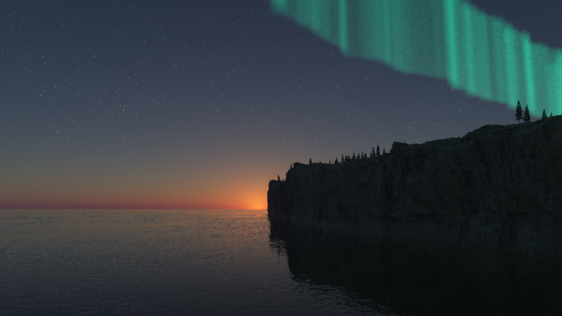

# Practical Exercise 3: Fractal Landscape
By Luis Daniel Casais Mezquida & Lucía María Moya Sans  
Computer Graphics 22/23  
Bachelor's Degree in Computer Science and Engineering, grp. 89  
Universidad Carlos III de Madrid

## Project statement
The aim is to generate a free scene of a landscape using [Terragen](https://planetside.co.uk/free-downloads/terragen-4-free-download/) software.  

Evaluating criteria will be the textures, atmospheric effects and the composition of the different objects in the scene.  
Terragen is a software oriented to the implementation of landscapes by using fractal algorithms to define the terrain and the clouds, where a pipeline scheme for generating the image will be needed. 

## Installation and execution
1. Download and install [Terragen 4](https://planetside.co.uk/free-downloads/terragen-4-free-download/) (only for Windows).
2. Open the application and load `src/main.tgd` (`File`>`Open`)
3. Render the image (`View`>`Render`>`Render`)

The result should be something like this:

## Useful links
These are links that may be useful for this exercise:

- [Terragen wiki](https://planetside.co.uk/wiki/index.php?title=Main_Page)
- [Examples](https://www.pinterest.es/pin/380413499769134831/)
